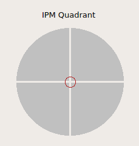
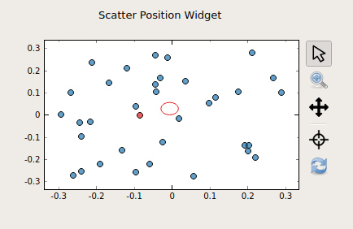
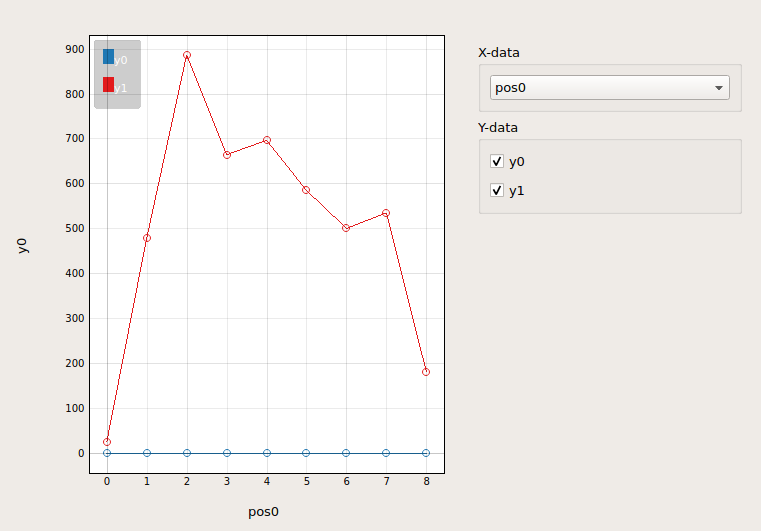
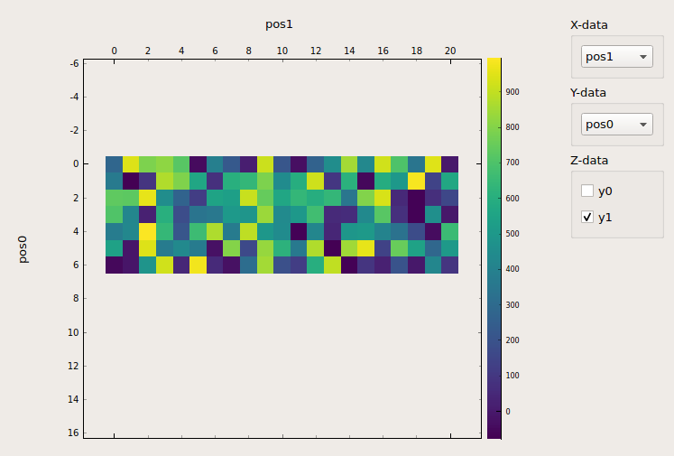
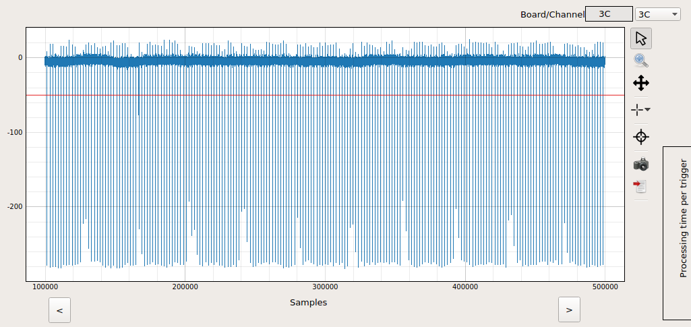

*****************
Extension Widgets
*****************

As it is an important part of the Karabo GUI to be of generic nature, the
``Karabo GUI Extensions`` will provide non-generic widgets. They are mostly
coupled to ``Node`` values that contain multiple properties and tailored for
devices.

IPM Quadrant Widget
===================

The ``IPM Quadrant Widget`` is tailored to provide the beam position on
a quadrant. The intensity can be used to visualize that there is no beam.
A red marker circle will visualize the beam position on the quadrant. Regarding
the position values, normalized (0 - 1) values are expected.
Please talk to controls development team if you want to have the intensity tailored.

- DisplayType: **WidgetNode|IPM-Quadrant**
- The Node Schema MUST contain three (3) elements:
    * **posX** (Float/Double)
    * **posY** (Float/Double)
    * **intensity** (Float/Double)

.. note::

   The widget is available since GUI Extension version **0.1.0**.

Scatter Position Widget
=======================

The ``Scatter Position Widget`` is tailored to provide the beam position with the
standard deviation of time.
A scatter plot is provided to provide the last updated `N` data points. The number
of data points `N` can be configured with the maximum number of 1000. The most recent
update is always shown with a ``red`` data point.
The standard deviation information from the device is used to provide an ellipse
around the scatter cloud.

- DisplayType: **WidgetNode|ScatterPosition**
- The Node Schema MUST contain four (4) elements:
    * **posX** (Float/Double)
    * **posY** (Float/Double)
    * **xSD** (Float/Double)
    * **ySD** (Float/Double)

.. note::

   The widget is available since GUI Extension version **0.2.0**.
   Known devices are: ``XGM`` and ``BeamPositionMonitor``

Karabacon Widget
================

The ``Karabacon Widget`` is tailored for the scantool at the European XFEL.

The widget automatically provides one-dimensional plots for spec-like scans
absolute scans such as ascan, dscan and cscans. If multiple motors or data
sources are selected for the scan, the plot can be configured respectively.

If a new scan is started, the plot is reset accordingly. In case of two
dimensional scans (mesh) a heatmap is provided where the axis and the data
sources can be selected.

- DisplayType: **WidgetNode|Scantool-Base**

.. note::

   The widget is available since GUI Extension version **0.3.0**.
   Known devices are: ``Karabacon``

Dynamic Digitizer Widget
========================

The ``Dynamic Digitizer Widget`` is tailored to visualize the monitoring output
of fast digitizers.

The fast plot uses a `Largest Triangle Three Buckets` downsample algorithm to
decrease the number of data points for visualization.
In addition, the `Node` provides the correct start and step point of the x-axis
trace.
For threshold visualization, a horizontal **red** line can be alternatively
toggled.

- DisplayType: **WidgetNode|DynamicDigitizer**
- The Node Schema MUST contain four (4) elements:
    * **samples** (NumberVector)
    * **offset** (Simple)
    * **step** (Simple)
    * **threshold** (Simple)

.. note::

   The widget is available since GUI Extension version **0.4.0**.
   Known devices are: ``adqDigitizer``
