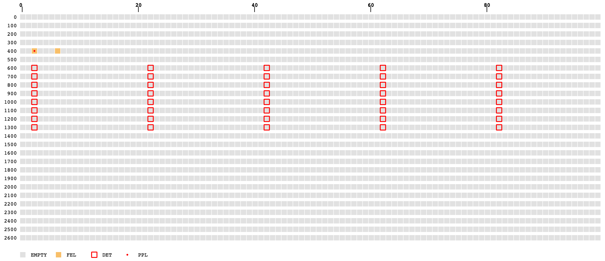
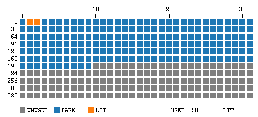
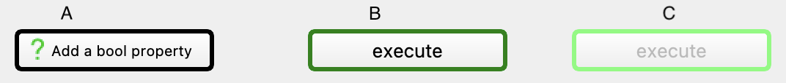

*****************
Extension Widgets
*****************

As it is an important part of the Karabo GUI to be of generic nature, the
``Karabo GUI Extensions`` will provide non-generic widgets. They are mostly
coupled to ``Node`` values that contain multiple properties and tailored for
devices.

IPM Quadrant Widget
===================

The ``IPM Quadrant Widget`` is tailored to provide the beam position on
a quadrant. The intensity can be used to visualize that there is no beam.
A red marker circle will visualize the beam position on the quadrant. Regarding
the position values, normalized (0 - 1) values are expected.
Please talk to controls development team if you want to have the intensity tailored.

.. figure:: images/ipm_quadrant.png
   :alt: ipm_quadrant.png
   :align: center

- DisplayType: **WidgetNode|IPM-Quadrant**
- The Node Schema MUST contain three (3) elements:
    * **posX** (Float/Double)
    * **posY** (Float/Double)
    * **intensity** (Float/Double)

.. note::

   The widget is available since GUI Extension version **0.1.0**.

Scatter Position Widget
=======================

The ``Scatter Position Widget`` is tailored to provide the beam position with the
standard deviation of time.
A scatter plot is provided to provide the last updated `N` data points. The number
of data points `N` can be configured with the maximum number of 1000. The most recent
update is always shown with a ``red`` data point.
The standard deviation information from the device is used to provide an ellipse
around the scatter cloud.

.. figure:: images/scatter_position.png
   :alt: scatter_position.png
   :align: center

- DisplayType: **WidgetNode|ScatterPosition**
- The Node Schema MUST contain two (2) elements:
    * **posX** (Float/Double)
    * **posY** (Float/Double)

.. note::

   The widget is available since GUI Extension version **0.2.0**.
   Known devices are: ``XGM`` and ``BeamPositionMonitor``

Karabacon Widget
================

The ``Karabacon Widget`` is tailored for the scantool at the European XFEL.

The widget automatically provides one-dimensional plots for spec-like scans
absolute scans such as ascan, dscan and cscans. If multiple motors or data
sources are selected for the scan, the plot can be configured respectively.

.. figure:: images/scantool_1d.png
   :alt: scantool_1d.png
   :align: center

If a new scan is started, the plot is reset accordingly. In case of two
dimensional scans (mesh) a heatmap is provided where the axis and the data
sources can be selected.

.. figure:: images/scantool_2d.png
   :alt: scantool_1d.png
   :align: center

- DisplayType: **WidgetNode|Scantool-Base**

.. note::

   The widget is available since GUI Extension version **0.3.0**.
   Known devices are: ``Karabacon``

Dynamic Digitizer Widget
========================

The ``Dynamic Digitizer Widget`` is tailored to visualize the monitoring output
of fast digitizers.

The fast plot uses a `Largest Triangle Three Buckets` downsample algorithm to
decrease the number of data points for visualization.
In addition, the `Node` provides the correct start and step point of the x-axis
trace.
For threshold visualization, a horizontal **red** line can be alternatively
toggled.

.. figure:: images/digitizer_dynamic.png
   :alt: digitizer_dynamic.png
   :align: center

- DisplayType: **WidgetNode|DynamicDigitizer**
- The Node Schema MUST contain four (4) elements:
    * **samples** (NumberVector)
    * **offset** (Simple)
    * **step** (Simple)
    * **threshold** (Simple)

.. note::

   The widget is available since GUI Extension version **0.4.0**.
   Known devices are: ``adqDigitizer``

Point-and-Click Widget
======================

This widget lets you show an image, show some crosses as markers, and let
the user move one cross.

The `DisplayType` is "WidgetNode|Point-and-Click", and its schema contains the
following elements:
  * **image** a `VectorChar` that contains the actual binary image, in a format
    known to Qt (e.g. PNG or JPG)
  * **x** and **y** are `VectorFloat`. They need to have the same length and
    define the position of the crosses shown to the user.
  * **cross_x** and **cross_y** are `Float` and receive the points the user
    has set the editable cross to.

Pulse Info Widget
=================

This widget shows absolute pulse information (FEL, PPL and Detector) at an instrument.

The `DisplayType` is "WidgetNode|PulseId-Map" and its schema contains the following
elements:
   * **fel** a `VectorBool` that contains 2700 elements
   * **ppl** a `VectorBool` that contains 2700 elements
   * **det** a `VectorBool` that contains 2700 elements

For each vector, a value `True` means this pulse ID (represented by the vector's index)
has an event (fel bunch, ppl bunch, detector frame), a value `False` mean no event for
the pulse ID.

Detector Cells Widget
=====================

This widget shows detector memory cells as a matrix indicating unused, dark and lit cells.

The `DisplayType` is "WidgetNode|DetectorCells" and its schema contains the following
elements:

* **nFrame** (`UInt16`) is the number of exposed frames (used cells).
* **nPulsePerFrame** (`VectorUInt16`) that contains `nFrame` elements. Every element is
  the number of exposed X-ray pulses in a frame.

Conditional Command
===================

The ``Conditional Command`` is a command button that represents a device slot. It additionally
requires a boolean property, to be associated with. Depending on the value of the boolean,
the button is enabled or disabled in the scene.

To convert a command button to a ``Conditional Command``:

#. Right click context menu-item 'Change Widget' -> 'Conditional Command'.
#. Add a Bool property proxy by dragging and dropping a Boolean parameter onto the button.

The ``Conditional Command`` button will have a colored border to differentiate it from
the normal command button.

If the Bool property and Slot property belong to different Devices, then both
Devices have to be online to enable the ``Conditional Command`` button.

Visual appearance of conditional button:

A) Before adding a Bool property.

B) The  added Bool property has the value `True` and the device is in one of
the allowed states of the slot.

C) The  added Bool property has the value `False`  or the current state of
the device does not allow the slot to be called.

Currently, only a single Bool property can be combined with a Slot to form a ``Conditional Command``.
If it is desired to combine several Bool properties or to invert the value(i.e, to enable the
button if the Bool is false), then the logic has to be coded in a device or macro and the result
needs to be exposed as another Bool that then can be used for the ``Conditional Command``.

Note that, in contrast to the protection of allowed states, the disabling of the ``Conditional Button``
is only active for buttons in scenes. The Bool property has no influence whether the slot can be
called via the configuration editor of the GUI or from other devices or macros.
